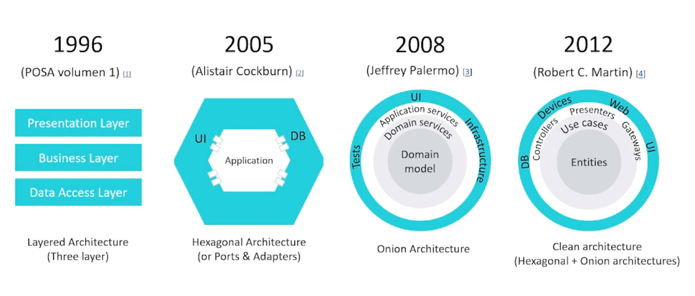

# Web API Microservice Architectures

## 🔖 Description

🎓 This repository contains examples about four architecture of software: 
 * Three Layer Architecture
 * Hexagonal Architecture
 * Onion Architecture
 * Clean Architecture

## 📎 Resources

Basic concepts you need to know:
* [📖 Los 5 principios SOLID](https://latteandcode.medium.com/los-5-principios-solid-68d697984abd)
* [📖 Inyección de dependencias en Node.js con InversifyJS & TypeScript](https://es.slideshare.net/RemoJansen/inyeccion-de-dependencias-en-nodejs-con-inversifyjs-typescript)

The first thing you should do is watch the following video:
* [🎥 Arquitectura Hexagonal con Typescript en APIs web con Nodejs | DotNet 2021](https://www.youtube.com/watch?v=ds7mHECHNj0)

Then you can dig deeper with more reading:
* [📖 POSA - Pattern–Oriented Software Architecture](https://www.amazon.es/Pattern-Oriented-Software-Architecture-System-Patterns/dp/0471958697)
* [📖 Hexagonal Architecture](https://alistair.cockburn.us/hexagonal-architecture)
* [📖 The Onion Architecture](https://jeffreypalermo.com/2008/07/the-onion-architecture-part-1/)
* [📖 The Clean Architecture](https://blog.cleancoder.com/uncle-bob/2012/08/13/the-clean-architecture.html)
